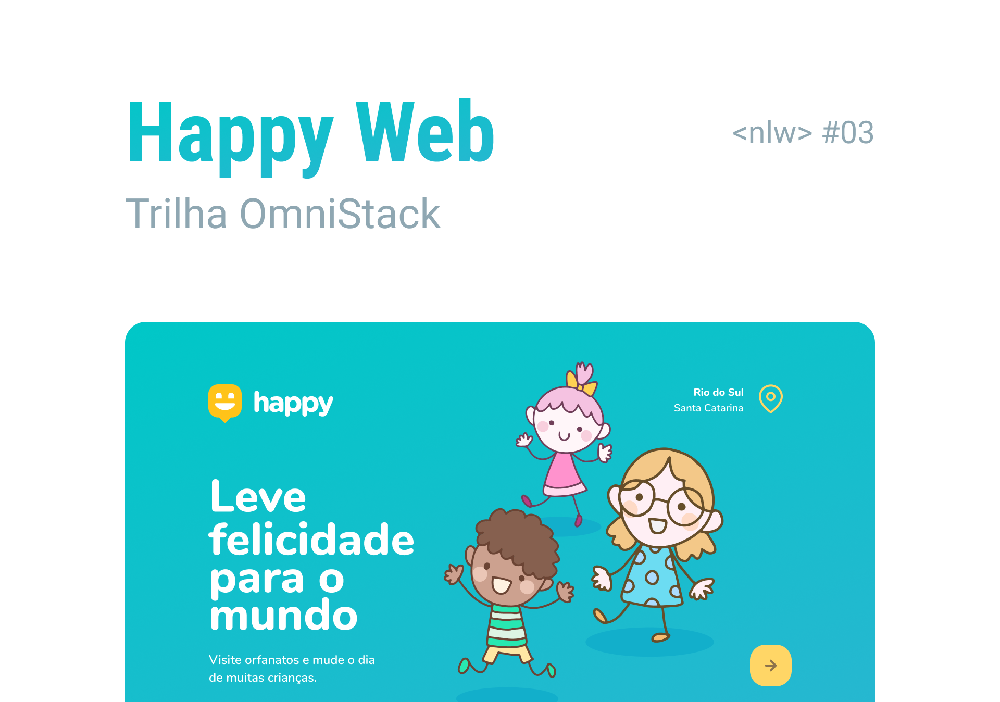
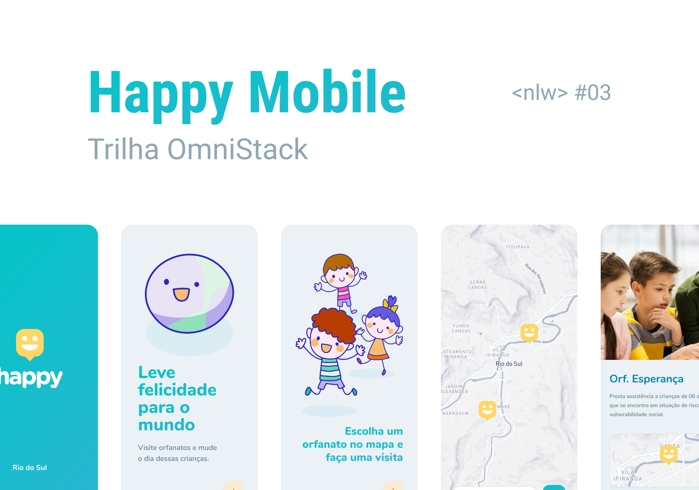

<h2 align="center">
            
</h2>
<h4 align="center">
            :building_construction: &nbsp; In construction
</h4>

<p align="center">

<a href="https://www.linkedin.com/in/jessica-zimmerhansl">
    
  </a>   
     <a href="https://github.com/jlzimmerhansl/happy">
    
  </a>    
                                                                                                         
  <a href="https://github.com/jlzimmerhansl/happy/commits/master">
    
  </a>

  <a href="https://github.com/jlzimmerhansl/happy">
    
  </a> 
</p>

## :bookmark: About the Project

We help to find orphanages that you can bring hapinnees to this childrens.

Project develope during the 3° Next Level Week, provided by [RocketSeat][url-rocket] :rocket:

## :artist: Layout

Web layout is availabe in [Figma][url-figma-web]

<h2 align="center">
            
</h2>

Mobile layout is availabe in [Figma][url-figma-mobile]

<h2 align="center">
            
</h2>

## :hammer_and_pick: Technologies

- [Node][url-node]
- [ReactJS][url-react]
- [React-Native][url-react-native]
- [Expo][url-expo]
- [TypeScript][url-typescript]

## :gear: How to use?

> :bulb: The web and mobile version depends on the server is running for its operation.

This project is divided in three parts:

1. Web
2. Mobile
3. Backend

## :mechanic: What do you need to use?

- [Git][url-git]
- [NodeJS][url-node]
- [Expo][url-expo]

## :package: How to clone?

```bash
# clone the repository
$ git clone https://github.com/jlzimmerhansl/happy.git
```

## :rocket: How to run?

```bash
# install the dependencies
$ yarn

# run server
$ cd backend
$ yarn dev

# run web
$ cd web
$ yarn start

# run mobile
$ cd mobile
$ yarn start
```

## :woman_student: Who taught the classes?

The classes was taught by [Diego Fernandes][url-diego].

---

<h4 align="center">
Made with :blue_heart: &nbsp; by <a href="https://www.linkedin.com/in/jessica-zimmerhansl" target="_blank">Jessica Zimmerhansl</a>
</h4>

[url-typescript]: https://www.typescriptlang.org
[url-node]: https://nodejs.org/pt-br/
[url-react]: https://reactjs.org
[url-expo]: https://reactjs.org
[url-react-native]: https://reactnative.dev
[url-git]: https://git-scm.com
[url-diego]: https://github.com/diego3g
[url-figma-web]: https://www.figma.com/file/0pQneqW3d87nTX7bwLOOlu/Happy-Web-Copy?node-id=0%3A1
[url-figma-mobile]: https://www.figma.com/file/zz5yHcncElKalD8TIVGIcA/Happy-Mobile-Copy?node-id=0%3A1
[url-rocket]: https://rocketseat.com.br
